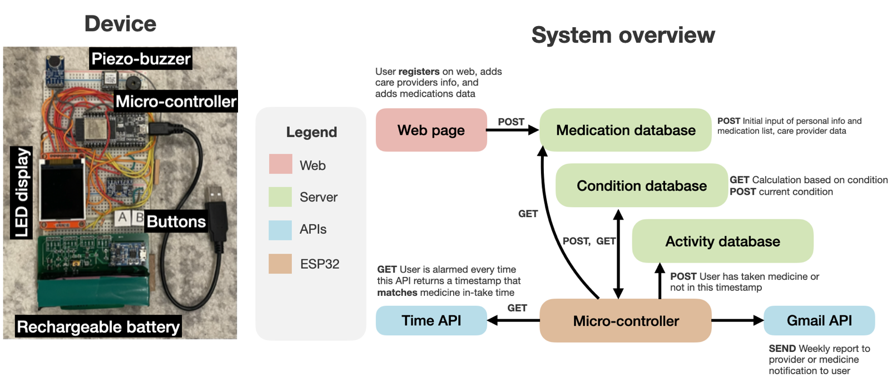

# Daymax
Daymax is a low-cost medication reminder system for elderly made with a micro-controller, LED, alarms, and a battery.
> Keyword: Emergency care, C++, Python, SQL, Postman API

## Background
* Medical non-adherence is when patients don't take their prescribed medicines or take them late
* The healthcare industry wastes ~1 billion every year due to medical non-adherence

## Project deliverables 
* An easy-to-use embedded system consisting of LED display, piezo buzzer, buttons, battery, and a heart rate sensor
* Users can set alarm schedule for their medications, snooze alarms, measure vital signs
* Care takers can view user's medication in-take history and be alerted when user skips their medication
* Medication data is safely secured in databases
* Users can register and change medication information via a web page

# How to use Daymax
Before using Daymax, configure email notification service:

1. Include ESP32 Mail Client library. In the Arduino IDE go to Sketch > Include Library > Manage Libraries. Search for "ESP32 Mail Client" by Mobizt, and install the library.
2. Close and restart the Arduino IDE.
3. If when compiling/uploading, you get an error of "#error: architecture or board not supported", go to the Arduino libraries folder in your local computer, then move/delete the entire "SD" folder from the libraries folder.
